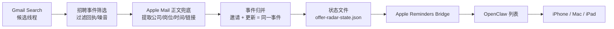

# OpenClaw Offer Radar


> 一个面向中文用户的 OpenClaw Skill：从 Gmail 招聘邮件里提取真正重要的面试、笔试、测评、授权信息，并同步到 Apple Reminders。

[](./SKILL.md)
[](./scripts/recruiting_sync.py)
[](./README.md)
[](./LICENSE)

---

## 它解决什么问题

很多招聘邮件不是“没有收到”，而是“收到了但没法稳定转成提醒”：

- 标题很泛，只写了 `面试信息有更新，请您确认`
- 发件人是 ATS 系统域名，看不出公司
- 同一个事件会收到多封邀请、更新、确认邮件
- 邮件里夹着投递成功、问卷、反馈、营销噪音
- 最后在提醒事项里不是重复一堆，就是漏掉真正的关键时间

`OpenClaw Offer Radar` 做的事情很明确：

1. 从 Gmail 里拉取最近几天候选邮件
2. 过滤掉“投递成功 / 收到申请 / 简历完善”这类纯回执
3. 对 `ibeisen / mokahr / nowcoder / 腾讯校招` 这类邮件提高召回
4. 用 Apple Mail 正文兜底提取公司名、岗位、时间和入口链接
5. 把“邀请函”和“信息更新”归并成同一个事件
6. 最终只生成一条干净的中文提醒

---

## 特性

- 中文优先：标题和备注都按中文阅读习惯生成
- 事件导向：一个事件只保留一条主提醒，不堆重复项
- 去噪稳定：纯回执、问卷、营销邮件默认不建提醒
- 更新覆盖：同一事件来了“信息更新”，会覆盖旧时间
- ATS 友好：适配 `ibeisen`、`mokahr`、`nowcoder`、`腾讯校招`
- Apple 生态：写入 Apple Reminders，自动同步到 iPhone / Mac / iPad
- OpenClaw 友好：仓库根目录就是标准 skill 结构

---

## 为什么它比“直接搜标题建提醒”更稳

这类招聘邮件真正麻烦的，不是搜索不到，而是信息散、标题泛、更新频繁：

- 同一个事件会收到 `邀请函`、`信息更新`、`确认提醒` 多封邮件
- 标题只写 `面试信息有更新，请您确认`
- 公司名和时间藏在 HTML 正文里
- 发件人经常是 ATS 系统域名，不是公司主域

这个 skill 的策略是：

- 先用 `gog` 从 Gmail 拿到候选线程
- 再用 Apple Mail 读取本地同步后的正文，补齐关键信息
- 最后按“事件”归并，而不是按“邮件”堆提醒

所以它的目标不是做一堆提醒，而是只留下真正要去参加、去完成、去处理的那一件事。

---

## 架构



---

## 仓库结构

```text
openclaw-offer-radar/
├── README.md
├── SKILL.md
├── LICENSE
├── .gitignore
├── assets/
│   └── banner.svg
└── scripts/
    ├── recruiting_sync.py
    └── apple_reminders_bridge.py
```

---

## 快速开始

### 1. 准备前置环境

- macOS
- Apple Mail 已绑定你的 Gmail
- Apple Reminders 已授权
- `gog` 已完成 Gmail OAuth

建议先确认：

```bash
gog auth list
remindctl status
```

### 2. 安装到 OpenClaw Skill 目录

```bash
git clone https://github.com/NissonCX/openclaw-offer-radar.git
cd openclaw-offer-radar
```

如果你想直接作为本地 skill 使用，建议放到：

```bash
~/.openclaw/workspace/skills/openclaw-offer-radar
```

### 3. 运行一次扫描

```bash
python3 scripts/recruiting_sync.py \
  --account your@gmail.com \
  --mail-account 谷歌
```

默认行为：

- 扫描最近 5 天
- 最多取 50 条候选线程
- 生成状态文件到 `~/.openclaw/workspace/memory/offer-radar-state.json`

### 4. 直接同步到提醒事项

```bash
python3 scripts/recruiting_sync.py \
  --account your@gmail.com \
  --mail-account 谷歌 \
  --sync-reminders
```

---

## 生成出来的提醒长什么样

### 标题

- `腾讯QQ客户端开发面试（3月30日 19:30）`
- `爱学习教育Java开发实习面试（4月2日 19:00）`
- `拼多多在线技术笔试（3月29日 15:00）`
- `腾讯AI面试（4月3日 10:09前完成）`

### 备注

只保留这几类信息：

- 面试 / 笔试 / 截止时间
- 岗位名
- 唯一有效入口链接
- 必要时的一句说明

不会写进去的东西：

- Gmail ID
- 一大段邮件摘要
- 纯投递成功回执
- 和当前事件无关的元数据

---

## 如何避免重复和漏抓

### 避免重复

同一个事件不会按邮件数创建提醒，而是按下面这组键归并：

`公司 + 事件类型 + 岗位 + 主入口链接`

这意味着：

- 邀请函和更新邮件会归并成一个事件
- 新邮件如果只是更新时间变化，会覆盖旧提醒
- 标题不会出现 `11点提醒` 这类调度噪音

### 尽量不漏

当前默认会：

- 扫描最近 5 天、最多 50 条 Gmail 候选线程
- 提高 `ibeisen / mokahr / nowcoder / 腾讯校招` 的召回
- 用 Apple Mail 正文兜底提取公司、岗位、开始时间、截止时间、入口链接
- 忽略只有投递反馈但没有面试/笔试/测评信息的邮件

如果你要补历史事件，可以手动扩大范围：

```bash
python3 scripts/recruiting_sync.py \
  --account your@gmail.com \
  --mail-account 谷歌 \
  --days 10 \
  --max-results 100
```

---

## 当前识别策略

### 会优先识别

- 面试邀请
- 面试信息更新
- 在线笔试
- 在线测评
- 授权 / 补充材料
- AI 面试 / 需要在若干小时内完成的事件

### 会默认忽略

- `投递成功`
- `收到申请`
- `感谢投递`
- `简历完善`
- `反馈问卷`
- `体验调研`

### 事件去重方式

不是按“邮件标题”去重，而是按：

`公司 + 事件类型 + 岗位 + 主入口链接`

这样同一个事件的“邀请函”和“信息更新”会合并成一个提醒。

---

## 适合哪些人

- 用 Gmail 收招聘邮件的中文用户
- 在 macOS / iPhone 上管理提醒事项的人
- 正在找实习 / 校招 / 社招，邮件很多又怕漏关键时间的人
- 已经在用 OpenClaw，想把招聘邮件流做成稳定 skill 的人

---

## 注意事项

- 这个 skill 当前是 **macOS + Apple Mail + Apple Reminders** 路线
- 如果 Apple Mail 没同步到本地，正文兜底提取会失效
- HTML 特别重的邮件偶尔可能读取慢，但不会因此把“投递成功回执”误建成提醒
- 当前默认只扫最近 5 天，如果你需要补历史邮件，可用 `--days 10`

---

## 推荐工作流

```bash
python3 scripts/recruiting_sync.py --account your@gmail.com --mail-account 谷歌
python3 scripts/recruiting_sync.py --account your@gmail.com --mail-account 谷歌 --sync-reminders
```

也可以把第一步接到 OpenClaw heartbeat 或自动化里，定期巡检。

---

## 为什么基于 Gmail + Apple Mail + Reminders

- `gog` 负责稳定读取 Gmail 权限，不需要自己再做一套 OAuth
- Apple Mail 已经把复杂 HTML 邮件和内嵌内容同步到本地，适合做正文兜底
- Apple Reminders 能直接同步到 iPhone，提醒链路足够短

这条技术路径很偏中文求职用户，也正是这个仓库要做稳的重点。

---

## 开源路线

这个仓库的目标不是做“所有邮箱、所有提醒系统”的大而全平台，而是先把这条高价值链路做稳：

`Gmail 招聘邮件 -> 中文事件识别 -> Apple Reminders`

后续可扩展方向：

- Outlook / IMAP 支持
- 非 macOS 提醒系统
- 更强的 HTML 正文解析
- 增量同步而不是整表重建
- 更丰富的 ATS 模板库

---

## License

[MIT](./LICENSE)
