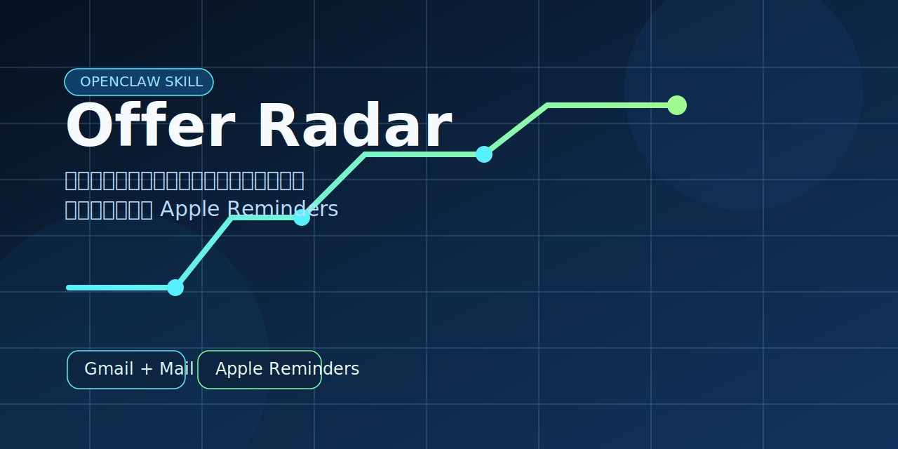

# OpenClaw Offer Radar



> 找工作时最烦的，不是没邮件，是重要邮件淹没在一堆无关邮件里。

[](./SKILL.md)
[](./scripts/recruiting_sync.py)
[](./README.md)
[](./LICENSE)

`OpenClaw Offer Radar` 是一个给中文用户用的 OpenClaw skill。

它不想替你“管理所有邮件”，它只盯一类真正容易误事的东西：面试、笔试、测评、授权、截止时间、更新通知。然后把这些信息整理成中文提醒，直接落进 iPhone 的原生提醒事项里。

## 为什么会有这个仓库

如果你最近在找实习、校招或者社招，这个场景应该很熟：

- 邮箱里全是投递成功、流程通知、系统回执、问卷和广告
- 真正重要的邮件只有少数几封，但偏偏最容易被埋掉
- 同一个事件还会发好几封，标题看起来都不一样，实际上说的是同一件事
- 等你想回头找时，最重要的不是“这封邮件写得多正式”，而是“到底几点”“在哪进”“什么时候截止”

这个 skill 想做的事情很简单：

把真正会影响你安排的招聘邮件捞出来，变成你在手机上一眼就能看懂、也不容易忘掉的提醒。

## 它适合谁

- 你主要用 Gmail 收招聘邮件
- 你平时用 iPhone，看原生提醒事项比翻邮箱快得多
- 你不想把“投递成功”这种邮件也塞进待办
- 你更在乎时间、入口链接、截止点，而不是一堆冗长邮件正文

## 它现在会做什么

当前版本重点处理这些事情：

- 从 Gmail 里找出高价值的招聘邮件
- 识别面试、笔试、在线测评、AI 面试、授权截止这类事件
- 尽量把同一事件的邀请、更新、确认合并成一条提醒
- 跳过投递成功、问卷、普通流程通知这类不值得提醒的内容
- 把提醒标题和备注整理成中文
- 在提醒里保留真正有用的信息：
  - 发生时间或截止时间
  - 必要时的岗位信息
  - 可直接进入的链接

## 一个最典型的用法

原来的邮箱里，可能会同时出现这些邮件：

- `来自字节跳动的面试邀请`
- `拼多多集团-PDD校招邀请你参加在线技术笔试`
- `腾讯邀请你参加AI面试-请在168小时内完成`
- `邀您完成应聘环节个人信息收集授权——来自美图招聘`

而在提醒事项里，你真正想看到的其实是：

- `字节跳动面试（3月31日 19:00）`
- `拼多多在线技术笔试（3月29日 15:00）`
- `腾讯AI面试（4月3日 10:09前完成）`
- `美图招聘授权（4月3日 16:22截止）`

这就是它想提供的体验：别让你在邮箱里翻半天，最后还是靠脑子硬记时间。

## 它不会做什么

- 不会把所有招聘邮件都塞进提醒事项
- 不会把投递成功、感谢投递、问卷之类的邮件硬写成待办
- 不会为了“看起来聪明”把没解析明白的信息乱写进提醒
- 不会把提醒写成一大段难读的机器摘要

## 快速开始

如果你已经有：

- macOS
- Gmail
- Apple Mail
- Apple Reminders
- `gog`

那就可以直接跑一次扫描：

```bash
python3 scripts/recruiting_sync.py \
  --account your@gmail.com \
  --mail-account 谷歌
```

如果要同步进提醒事项：

```bash
python3 scripts/recruiting_sync.py \
  --account your@gmail.com \
  --mail-account 谷歌 \
  --sync-reminders
```

如果你是在 OpenClaw 里使用它，也可以把这条流程接到 heartbeat，让它自己定期检查，不用每次手动触发。

## 当前方向

这个仓库现在先把一件事做好：

**把 Gmail 里的重要招聘事件，变成 iPhone 上好找、好记、好点开的原生提醒。**

后面会继续往更普适的方向走，但不会为了“看起来很大而全”先把仓库写得很满。

## License

[MIT](./LICENSE)
